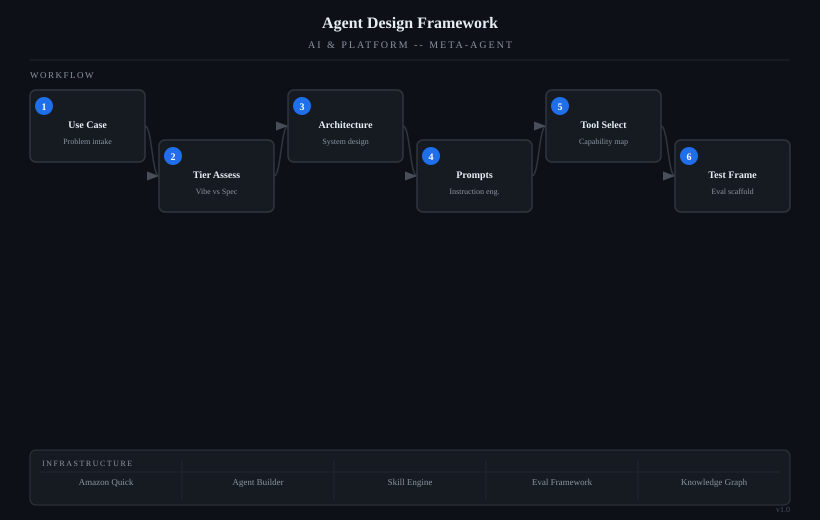

# Agent Design Framework

> Meta-agent that helps design and architect new AI agents using a two-tier framework: Vibe Coding (fast task agents with SOPs and knowledge bases) and Spec-Driven (architecture-first design for complex, compliance, or multi-phase agents).

## Architecture

*System-model diagram showing the agent's workflow, data flow, and supporting infrastructure.*

## Problem It Solves

Meta-agent that helps design and architect new AI agents using a two-tier framework: Vibe Coding (fast task agents with SOPs and knowledge bases) and Spec-Driven (architecture-first design for complex, compliance, or multi-phase agents). Routes any agent idea through decision logic to determine the appropriate design tier, then guides construction through the correct framework phases. Produces architectural maps, instruction templates, and reference document structures. Grounded in the Agent Design Framework reference document.

## How It Works

- Operates as a conversational AI agent with domain-specific knowledge
- Accepts natural language queries and returns structured, actionable guidance
- Built on Amazon Quick's agent architecture with custom skill integrations

## Key Capabilities

- Meta-agent that helps design and architect new AI agents using a two-tier framework: Vibe Coding (fast task agents with SOPs and knowledge bases) and Spec-Driven (architecture-first design for complex
- or multi-phase agents). Routes any agent idea through decision logic to determine the appropriate design tier
- then guides construction through the correct framework phases. Produces architectural maps
- instruction templates

## Technologies

## Built With

Built with [Amazon Quick](https://github.com/SwooshJ-SecAI) as a custom AI agent.

---
*Part of the [SwooshJ-SecAI](https://github.com/SwooshJ-SecAI) security and AI engineering portfolio.*
